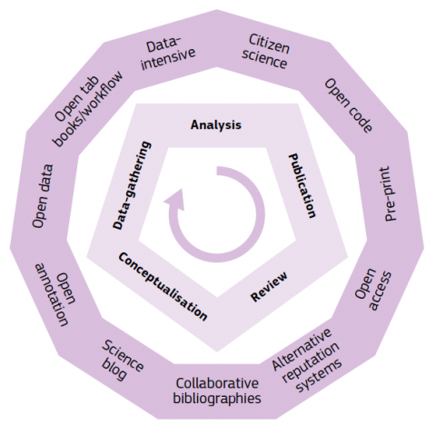
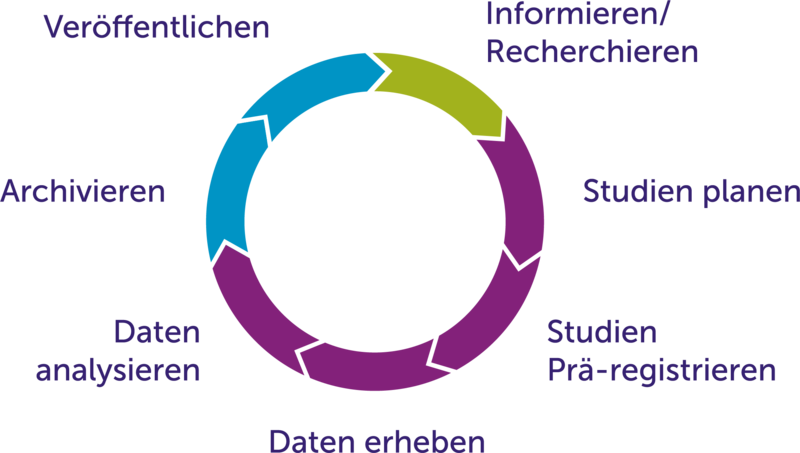

layout: true
  

  <table>
    <tr>
      <td style="text-align:right">Sächsische Landesbibliothek – Staats- und Universitätsbibliothek</td>
      <td>24.02.2021</td>
      <td style="text-align:right"><a href="https://www.slub-dresden.de/">www.slub-dresden.de</a></td>
    </tr>
    <tr>
      <td style="text-align:right">Referat 4.3</td>
      <td />
    </tr>
  </table>

  <table>
    <tr>
      <td style="text-align:left"><b>Kay-Michael Würzner</b></td>
    </tr>
    <tr>
      <td style="text-align:left">Referat 4.3 Open Science</td>
    </tr>
    <tr>
      <td style="font-size:8pt"><b>24.02.2021</b></td>
    </tr>
    <tr>
      <td style="font-size:8pt">Kick-off Open Science Center</td>
    </tr>
  </table>

---

class: title-slide
count: false

# Das SLUB *Open Science Lab*
## Services rund um einen offenen Forschungskreislauf

---

# Inhalt

- Motivation
- Überblick über existierende Services an der SLUB
    + *Open Education*
    + *Open Data*
    + *Open Evaluation*
    + *Open Access*
    + *Citizen Science*
- die Labs der SLUB als Plattform für eine offene Wissenschaftskultur
- Perspektive für ein gemeinsames **Open Science Center**

---

class: part-slide
count: false

# Motivation

---

## Grundlage

- Strategiepapier SLUB 2025:

> Die SLUB definiert ihre Aufgaben entlang des gesamten
> Forschungskreislaufs und fördert den Transformationsprozess
> zu Open Science durch Dienstleistungen und Werkzeuge zum
> Forschungsdatenmanagement, zum wissenschaftlichen Schreiben
> und Publizieren oder zur Wirkungsanalyse von Publikationen.

---

## Forschungskreislauf

.cols[
.forty[

]
.sixty[
- Anpassung existierender Services
- perspektivisch Ergänzung um fehlende Bereiche
- Orientierung an den fächerübergreifenden Aspekten wissenschaftlichen Arbeitens
- Ziel: Infrastruktur für offene Wissenschaften
]
]

---

class: part-slide
count: false

# Überblick über existierende Services an der SLUB

---

## Informieren und Recherchieren

- bibliothekarisches Kernaufgabe
- Werkzeuge
    + Katalog
    + Digitale Sammlungen
- Beratungs- und Vermittlungsangebote
    + Wissensbar u.a.
        * themenspezifische Recherche (Fachreferenten)
        * virtuelle Forschungsumgebungen
    + Semestereinführung
    + Graduiertenakademie
    + ...
- Services
    + Auftragsrecherchen
    + Kauftipps

---

## (Wissenschaftliches) Schreiben

- insbesondere im **SLUB TextLab**
    + Kooperation mit **TUD Schreibzentrum**
- Beratungs- und Vermittlungsangebote
    + Techniken des Schreibens
        * traditionelle und innovative Beratungsformate
    + technische Grundlagen
        * Textverarbeitungsprogramme
        * XML/TEI
    + Zitiertechniken und -werkzeuge
        * Zotero, Mendeley, Citavi, Endnote
        * unter fachspezifische Gesichtspunkten
    + Blog: [textlab.hypotheses.org](https://textlab.hypotheses.org/)

---

## Offene Lehr- und Lernmaterialien

- Referat *Open Education*
- Kooperation mit **ZiLL** zu OER-Beratung
- [„OER-Manifest“](https://slub.github.io/oer-display/assets/img/OER.pdf) und [FAQ](https://slub.github.io/oer-display/assets/img/OER-FAQ.pdf)
    + im Ratifizierungsprozess
    + parallel zu Open-Access-Resolution
- Beratungs- und Vermittlungsangebote
    + Produktion und Lizenzmanagement von OER
    + didaktische und technische Grundlagen
- Werkzeuge
    + [OER-Display](https://slub.github.io/oer-display)
- Services
    + buchbare Räumlichkeiten
    + extern nutzbare Aufnahme- und Präsentationstechnik

---

## Forschungsdatenmanagement

- insbesondere **gemeinsame Kontaktstelle Forschungsdaten**
- darüberhinaus Beteiligung an **NFDI4Culture** und **NFDI4Ing**
- Beratungs- und Vermittlungsangebote
    + während der Antragsphase
        * Datenmanagementpläne
    + während des Forschungsprozesses
        * Datenverwaltung und Ablagesystematik
        * geeignte Werkzeuge und Datenbanken
    + nach Abschluss des Forschungsprozesses
        * Veröffentlichung von Forschungsdaten
        * geeignete Repositorien und Metadatenformate
- Services
    + Implementierungsaufträge
        * Werkzeuganpassung
        * Datenbankschemata

---

## Publikationsberatung

- in enger Abstimmung mit dem **Forschungsinformationssystem**
     + gemeinsames Bibliometriekonzept in Vorbereitung
- Beratungs- und Vermittlungsangebote
     + Identifikation geeigneter Publikationsmedien
         * auf Basis inhaltlicher Angaben und bisheriger Veröffentlichungen
         * spezieller Fokus auf Bereich *Open Access*
     + akademisches Identitätsmanagement
         * ORCID und Co.
     + *Research Analytics Seminar*
         * regelmäßiges wissenschaftl. Kolloquium zu Bibliometrie
- Services
     + bibliometrische Analysen
         * Individualevaluation
         * Publikationsmonitoring

---

## Open-Access-Transformation

- Schwerpunkt im **Bestandsaufbau**
- Beratungs- und Vermittlungsangebote
    + regelmäßige Vortragstätikeit z.B.
        * Open-Access-Tage
        * Graduiertenakademie
    + *Predatory Publishing*
- Services
    + Finanzierung von Open-Access-Publikationen
        * Zeitschriften und Monographien
- Werkzeuge
    + *Qucosa*
        * (Zweit-)Veröffentlichungsplattform
        * Dissertationen, Studienarbeiten
    + *Qucosa Journals*
        * OJS-basierte Plattform für OA-Zeitschriften

---

## gesamtgesellschaftlicher Transfer

- Doppelfunktion als Universitäts- und **Landesbibliothek**
- traditionell breites Spektrum an Nutzenden
    + Zugriff auf **bürgerwissenschaftliche** Kontexte
- Beratungs- und Vermittlungsangebote
    + alle Angebote offen
    + Hackathons, Transcibathons
        * *Sachsen at Work*
        * *Coding da Vinci* 2022
    + *Wikisource*-Beratung
    + Dresdner Seniorenakademie
- Werkzeuge z.B.
    + virtuelles Kartenforum
        * kollaborative Georeferenzierung historischer Karten

---

class: part-slide
count: false

# Plattform für eine offene Wissenskultur

---

## SLUB Lab-Landschaft

- Labs als räumliche Manifestation einer offenen, partizipativen Wissenskultur
    * SLUB TextLab
        + Fokus **textuelle Materialien**
        + wissenschaftliches Schreiben (und Lesen)
    * SLUB Makerspace
        + Fokus **Werkstoffe und Technik**
        + offene Werkstatt und Kreativraum
    * SLUB Musicspace
        + Fokus **Musikalien**
        + kreative Auseinandersetzung mit den audio-visuellen Medien der SLUB
    * SLUB Open Science Lab
        + Fokus **forschungsnahe Dienste**
        + Services rund um einen offenen Forschungskreislauf

---

class: part-slide
count: false

# Perspektive für ein gemeinsames *Open Science Center*

---

## gemeinsames *Open Science Center*

- Kreis gemeinsam schließen!
    + Verbindung der Beratungsangebote der TUD mit denen der SLUB
    + Berücksichtigung fachspezifischer Aspekte in Ergänzung zur
    + fächerübergreifenden Methodik des wissenschaftlichen Arbeitens
    + curriculare Einbettung

<h2>Open Science Lab → Open Science Center</h2>

---

class: part-slide

# Vielen Dank für Ihre Aufmerksamkeit

<a href="https://wrznr.github.io/slub-open-science-2021/">wrznr.github.io/slub-open-science-2021</a>

