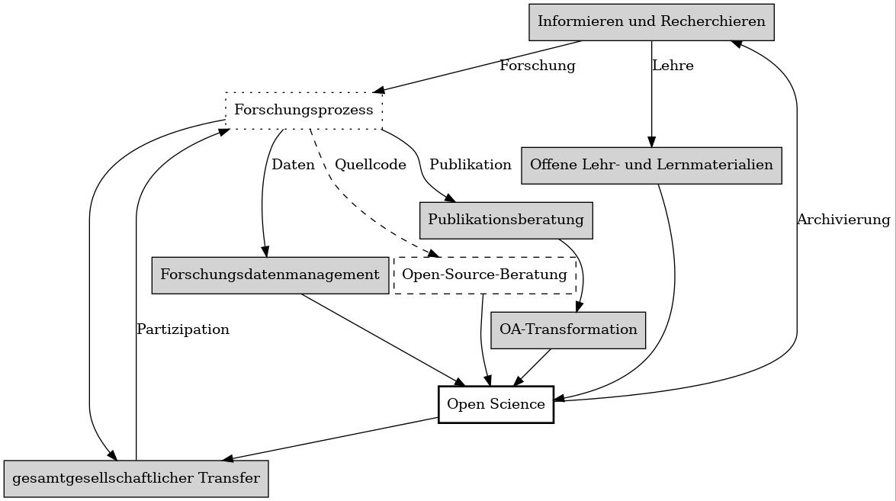

layout: true
  

  <table>
    <tr>
      <td style="text-align:right">Sächsische Landesbibliothek – Staats- und Universitätsbibliothek</td>
      <td>24.02.2021</td>
      <td style="text-align:right"><a href="https://www.slub-dresden.de/">www.slub-dresden.de</a></td>
    </tr>
    <tr>
      <td style="text-align:right">Referat 4.3</td>
      <td />
    </tr>
  </table>

  <table>
    <tr>
      <td style="text-align:left"><b>Kay-Michael Würzner</b></td>
    </tr>
    <tr>
      <td style="text-align:left">Referat 4.3 Open Science</td>
    </tr>
    <tr>
      <td style="font-size:8pt"><b>24.02.2021</b></td>
    </tr>
    <tr>
      <td style="font-size:8pt">Kick-off Open Science Center</td>
    </tr>
  </table>

---

class: title-slide
count: false

# *Open Science* an der SLUB
## Services rund um einen offenen Forschungskreislauf

---

# Inhalt

- Motivation
- Überblick über existierende Services an der SLUB
    + *Open Education*
    + *Open Data*
    + *Open Evaluation*
    + *Open Access*
    + *Citizen Science*
- die Labs der SLUB als Plattform für eine offene Wissenschaftskultur
- Perspektive für ein gemeinsames **Open Science Center**
- Status **Bauplanung**

---

class: part-slide
count: false

# Motivation

---

## Grundlage

- Strategiepapier SLUB 2025:

> Die SLUB definiert ihre Aufgaben entlang des gesamten
> Forschungskreislaufs und fördert den Transformationsprozess
> zu Open Science durch Dienstleistungen und Werkzeuge zum
> Forschungsdatenmanagement, zum wissenschaftlichen Schreiben
> und Publizieren oder zur Wirkungsanalyse von Publikationen.

---

## Forschungskreislauf

- Anpassung existierender Services
- perspektivisch Ergänzung um fehlende Bereiche
- Ziel: Infrastruktur für offene Wissenschaften

---

class: part-slide
count: false

# Überblick über existierende Services an der SLUB

---

## Informieren und Recherchieren

- Werkzeuge
    + Katalog
    + Digitale Sammlungen
- Beratungs- und Vermittlungsangebote
    + Wissensbar u.a.
        * themenspezifische Recherche (Fachreferenten)
        * virtuelle Forschungsumgebungen
    + Semestereinführung, Graduiertenakademie ...
- Services
    + Auftragsrecherchen
    + Kauftipps

<h3>bibliothekarische Kernaufgabe</h3>

---

## (Wissenschaftliches) Schreiben

- Beratungs- und Vermittlungsangebote
    + Techniken des Schreibens
        * traditionelle und innovative Beratungsformate
    + technische Grundlagen
        * Textverarbeitungsprogramme, XML/TEI ...
    + Zitiertechniken und -werkzeuge
        * Zotero, Mendeley, Citavi, Endnote
        * unter fachspezifische Gesichtspunkten
    + Blogging: [textlab.hypotheses.org](https://textlab.hypotheses.org/)

<h3>SLUB TextLab &amp; TUD Schreibzentrum</h3>

---

## Offene Lehr- und Lernmaterialien

- [OER-Empfehlung](https://slub.github.io/oer-display/assets/img/OER.pdf) und [FAQ](https://slub.github.io/oer-display/assets/img/OER-FAQ.pdf)
    + parallel zu Open-Access-Resolution
    + im Ratifizierungsprozess
- Beratungs- und Vermittlungsangebote
    + Produktion und Lizenzmanagement von OER
    + didaktische und technische Grundlagen
- Werkzeuge
    + [OER-Display](https://slub.github.io/oer-display)
- Services
    + buchbare Räumlichkeiten
    + extern nutzbare Aufnahme- und Präsentationstechnik

<h3>Ref. Open Education &amp; ZiLL</h3>

---

## Forschungsdatenmanagement

- Beratungs- und Vermittlungsangebote
    + während der Antragsphase
        * Datenmanagementpläne
    + während des Forschungsprozesses
        * Datenverwaltung und Ablagesystematik
        * geeignte Werkzeuge und Datenbanken
    + nach Abschluss des Forschungsprozesses
        * Veröffentlichung von Forschungsdaten in geeigneten Repositorien
- Services
    + Implementierungsaufträge
        * Werkzeuganpassung, Datenbankschemata ...

<h3>gemeinsame Kontaktstelle FD</h3>

---

## Publikationsberatung

- Beratungs- und Vermittlungsangebote
     + Identifikation geeigneter Publikationsmedien
         * auf Basis inhaltlicher Angaben und bisheriger Veröffentlichungen
         * spezieller Fokus auf Bereich *Open Access*
     + akademisches Identitätsmanagement
         * ORCID und Co.
     + *Research Analytics Seminar*
         * regelmäßiges wissenschaftl. Kolloquium zu Bibliometrie
- Services
     + bibliometrische Analysen
         * Individualevaluation
         * Publikationsmonitoring

<h3>Team Bibliometrie &amp; FIS</h3>

---

## Open-Access-Transformation

- Beratungs- und Vermittlungsangebote
    + regelmäßige Vortragstätikeit z.B. **Open-Access-Week**
    + *Predatory Publishing*
- Services
    + Finanzierung von Open-Access-Publikationen (auch Monographien)
- Werkzeuge
    + *Qucosa* und
    + *Qucosa Journals*
        * OJS-basierte Plattform für OA-Zeitschriften

<h3>Schwerpunkt im **Bestandsaufbau**</h3>

---

## gesamtgesellschaftlicher Transfer

- traditionell breites Spektrum an Nutzenden
    + Zugriff auf **bürgerwissenschaftliche** Kontexte
- Beratungs- und Vermittlungsangebote
    + alle Angebote offen
    + Hackathons, Transcibathons
        * *Sachsen at Work*, *Coding da Vinci* 2022 ...
    + *Wikisource*-Beratung
    + Dresdner Seniorenakademie
- Werkzeuge z.B.
    + virtuelles Kartenforum
        * kollaborative Georeferenzierung historischer Karten

<h3>Querschnittsthema in vielfältigen Koops</h3>

---

class: part-slide
count: false

# Plattform für eine offene Wissenskultur

---

## SLUB Labs

- Labs als räumliche Manifestation einer offenen, anwendungsorientierten, partizipativen Wissenskultur
    * SLUB TextLab
        + Fokus **textuelle Materialien**
        + wissenschaftliches Schreiben (und Lesen)
    * SLUB Makerspace
        + Fokus **Werkstoffe und Technik**
        + offene Werkstatt und Kreativraum
    * Open Science Center
        + Fokus **forschungsnahe Dienste**
        + Services rund um einen offenen Forschungskreislauf

---

class: part-slide
count: false

# Perspektive für ein gemeinsames *Open Science Center*

---

- Portfolio gemeinsam vervollständigen!
    + Verbindung der Beratungsangebote der TUD mit denen der SLUB
    + Berücksichtigung **fachspezifischer Aspekte** in Ergänzung zur
    + fächerübergreifenden Methodik des wissenschaftlichen Arbeitens
    + curriculare Einbettung

<h2>→ Open Science Center</h2>

---

class: part-slide
count: false

# Bauplanungen

---

# Status Bauplanungen

- Einbettung des Bereiches *Open Science* in Bibliothek Bergstr. (von-Gerber-Bau)
- bauliche Ertüchtigung bis 2024
    + Umzug Bibliothek nach Zell21 (Barmergebäude)
- attraktiver Ort direkt an der Campusachse dann ab 2024
- jeweils gute räumliche Möglichkeiten
    * Co-Working Space
    * buchbare Räume
    * Open-Science-Theke

---

class: part-slide

# Vielen Dank für Ihre Aufmerksamkeit

<a href="https://wrznr.github.io/slub-open-science-2021/">wrznr.github.io/slub-open-science-2021</a>

